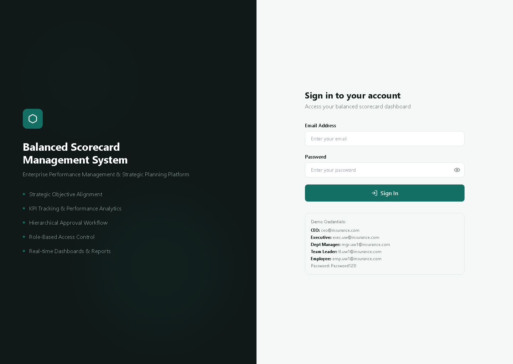
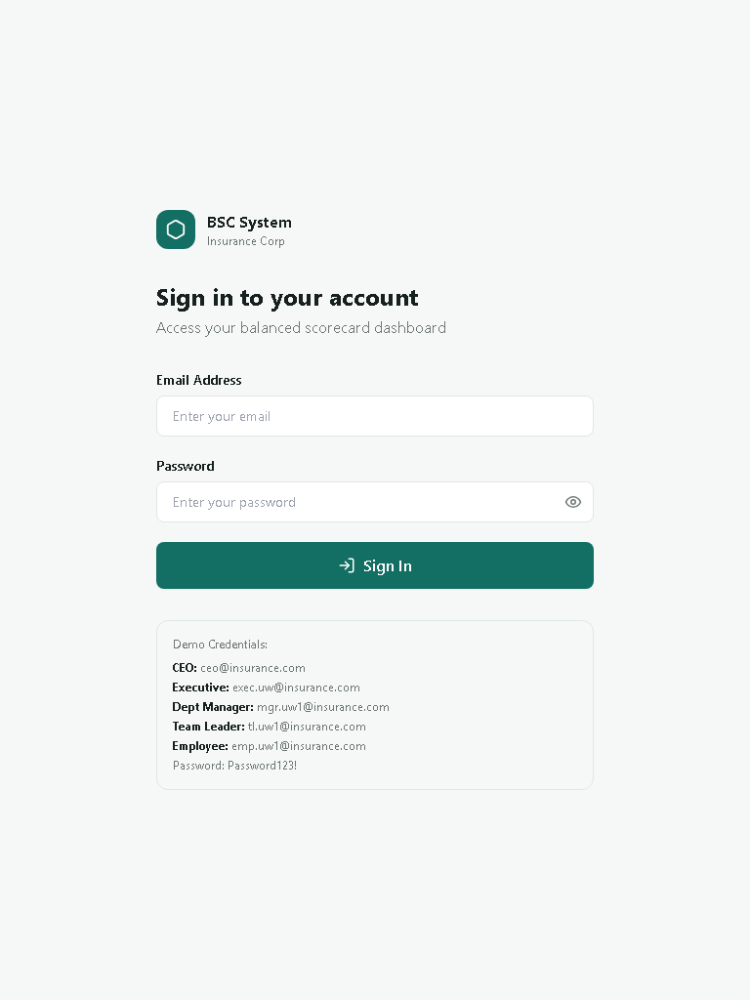
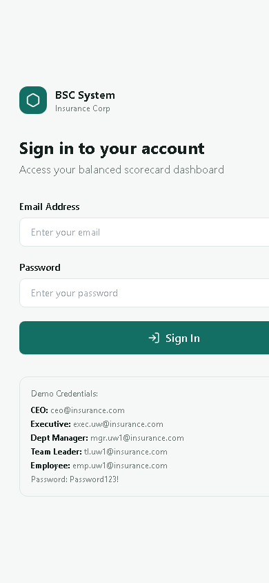

# BSC Management System — Device Preview

**Live application:** <https://bsc-digtal-frontend-uq9p.vercel.app>

These screenshots were captured from the live login page on 23 August 2026. They show the current layout before a user signs in.

| Device category | Viewport | Current appearance |
| --- | --- | --- |
| Desktop / laptop | 1440 × 1024 px | Two-column sign-in page: product information on the left and the form on the right. |
| Tablet | 768 × 1024 px | A single, centred sign-in form with the product identity at the top. |
| Mobile | 390 × 844 px | A single-column sign-in form. The inputs and sign-in button extend past the right edge at this width, as shown below. |

## Desktop / laptop

## Tablet

## Mobile

## Notes

- The desktop layout uses the available horizontal space effectively, while tablet switches to a focused centred form.
- The 390 px mobile capture reveals horizontal overflow in the form controls. This should be corrected before presenting the application as fully mobile-ready.
- The login screen currently displays demo account details publicly. Replace or remove those details for a production deployment with real users.
